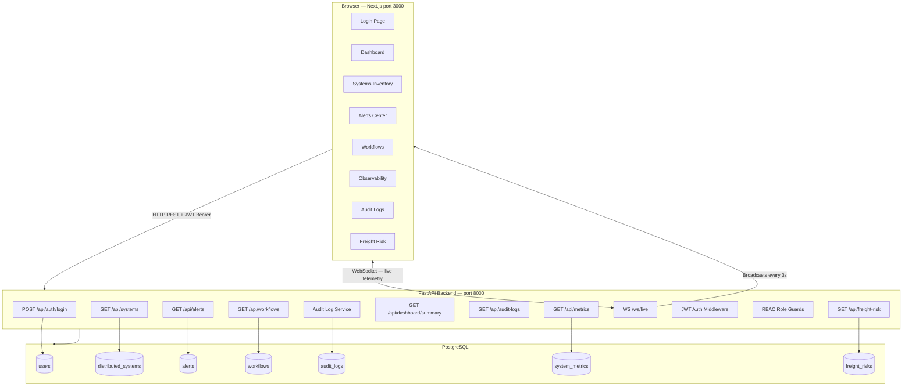

# Rail Logistics Control Plane

A production-grade operations control plane for managing distributed freight rail technology infrastructure across cloud, edge, and data center environments. Simulates the internal tooling used by large-scale railroad technology organizations — where thousands of microservices, IoT edge gateways, stream processors, and batch ETL workers must be monitored, alerted on, and operated 24/7 across geographically distributed corridors.

> **Simulated data only.** No real railroad systems, proprietary rail data, or external carrier APIs are used.

---

## Engineering Context

Large freight rail operations run distributed systems across three tiers: **cloud** (routing engines, ML inference, REST/gRPC APIs), **edge** (yard gateways, IoT stream processors, protocol bridges at trackside), and **data center** (mainframe adapters, batch ETL workers, constraint-based routing). Failures in any tier directly affect car-location accuracy, crew scheduling, and on-time performance across thousands of miles of corridor.

This project was built to demonstrate the engineering depth required to design, build, and operate that kind of infrastructure:

**Distributed systems design:**
- Models 11 heterogeneous services across cloud, edge, and data center — each with distinct service types (Kafka consumer, gRPC-gateway, Flink stream processor, mainframe MQ adapter, CDC event publisher, constraint-based routing engine)
- Tracks per-system heartbeat freshness, latency, version, and owning team — mirroring how a real service registry or CMDB is structured at scale
- Real-time telemetry broadcast via WebSocket — simulating the event-streaming pattern used in distributed ops platforms

**Secure, role-gated API design:**
- JWT authentication with HS256, enforced via FastAPI dependency injection on every route
- Three-tier RBAC (Admin / Operator / Viewer) — authorization checked server-side, not just in the UI
- Immutable audit log written on every write action: login, alert state change, workflow approval, system update

**Observability and SRE patterns:**
- Metric field naming follows OpenTelemetry/Prometheus conventions (`latency_ms`, `error_rate`, `heartbeat_age_seconds`)
- Alert model includes severity tiers (P0 critical → low), acknowledgement workflow, and resolution tracking — consistent with PagerDuty/OpsGenie data models
- Ops workflow types mirror real runbook actions: `hotfix_deployment`, `tls_certificate_rotation`, `ml_model_promotion`, `routing_table_update`, `horizontal_scaling_event`
- Rule-based freight risk engine scores delay probability per corridor based on system status and SLO breach severity

**Production engineering:**
- Async SQLAlchemy 2.0 with asyncpg — non-blocking DB I/O throughout
- Structured JSON logging via structlog on every request (method, path, status, duration_ms, client_host)
- Multi-stage Docker builds with `.dockerignore` — lean production images
- 20 integration tests via pytest-asyncio + httpx AsyncClient against a real in-memory DB stack (no mocking)
- Global FastAPI exception handlers return structured JSON for both validation errors (field-level) and unhandled exceptions — no raw tracebacks exposed to clients
- Pydantic v2 `field_validator` on all write schemas: non-blank string enforcement, max-length limits, allowed-value sets for workflow types, non-negative latency
- Pagination (`limit`/`offset`) on all list endpoints; systems endpoint accepts `environment` and `status` filter params
- `source_system_id` validated against the DB before alert creation — 422 with descriptive message on unknown system reference

---

## Architecture



---

## Tech Stack

| Layer | Technology |
|---|---|
| Frontend | Next.js 16 (App Router), TypeScript, Tailwind CSS v4 |
| Charts | Recharts |
| UI Components | Custom component library — Toast, PageHeader, PageError, EmptyState, Card, Modal, Select, Spinner |
| Backend | FastAPI, Python 3.11+ |
| Database | PostgreSQL 16 (SQLite + aiosqlite for local dev/tests) |
| ORM | SQLAlchemy 2.0 async |
| Auth | JWT (python-jose, HS256), bcrypt (passlib) |
| Validation | Pydantic v2 with `field_validator` |
| Error handling | Global FastAPI exception handlers — structured JSON for validation errors and 500s |
| Logging | structlog (structured JSON per request) |
| Real-time | WebSocket (native FastAPI + browser WebSocket API) |
| Testing | pytest, pytest-asyncio, httpx AsyncClient |
| Infrastructure | Docker Compose with multi-stage builds and health checks |

---

## Local Setup

### Option A — Docker Compose (full stack)

```bash
git clone <repo-url>
cd rail-logistics-control-plane

cp .env.example .env
# Edit .env if needed (defaults work for local dev)

docker compose up --build
```

- Frontend: http://localhost:3000
- Backend API: http://localhost:8000
- API Docs (Swagger): http://localhost:8000/docs
- API Docs (ReDoc): http://localhost:8000/redoc

---

### Option B — Local development (no Docker)

**Backend:**

```bash
cd backend
python -m venv .venv && source .venv/bin/activate
pip install -r requirements.txt

# Uses SQLite by default — no Postgres needed for dev
uvicorn app.main:app --reload
```

**Frontend:**

```bash
cd frontend
npm install
npm run dev
```

---

### Running tests

```bash
cd backend
source .venv/bin/activate
pytest -v
```

---

## Demo Credentials

| Role | Email | Password | Permissions |
|---|---|---|---|
| Admin | admin@railops.local | admin123 | Full access — read + mutate all resources, approve workflows, manage users |
| Operator | operator@railops.local | operator123 | Read all + acknowledge/resolve alerts + create workflow requests |
| Viewer | viewer@railops.local | viewer123 | Read-only access to all dashboards and tables |

---

## RBAC Explanation

Role-based access control is enforced at the API layer using FastAPI dependency injection. Every protected route declares a role guard (`require_admin()`, `require_operator_or_admin()`, or `require_any_role()`). The JWT payload carries the user's role and is verified on every request.

| Action | Admin | Operator | Viewer |
|---|:---:|:---:|:---:|
| View dashboard, systems, alerts, workflows | ✅ | ✅ | ✅ |
| View audit logs, metrics, freight risk | ✅ | ✅ | ✅ |
| Acknowledge alerts | ✅ | ✅ | ❌ |
| Resolve alerts | ✅ | ✅ | ❌ |
| Create workflow requests | ✅ | ✅ | ❌ |
| Approve / reject workflows | ✅ | ❌ | ❌ |
| Create / update / delete systems | ✅ | ❌ | ❌ |

---

## API Route Summary

### Auth
| Method | Route | Description |
|---|---|---|
| POST | /api/auth/login | Authenticate and receive JWT |
| GET | /api/auth/me | Get current user from token |

### Systems
| Method | Route | Description |
|---|---|---|
| GET | /api/systems | List systems — filter by `environment`, `status`; paginate with `limit`/`offset` |
| GET | /api/systems/{id} | Get system by ID |
| POST | /api/systems | Create system (admin) |
| PATCH | /api/systems/{id} | Update system (admin) |
| DELETE | /api/systems/{id} | Delete system (admin) |

### Alerts
| Method | Route | Description |
|---|---|---|
| GET | /api/alerts | List alerts — filter by `severity`, `status`; paginate with `limit`/`offset` |
| GET | /api/alerts/{id} | Get alert by ID |
| POST | /api/alerts | Create alert (admin) — validates `source_system_id` against registered systems |
| POST | /api/alerts/{id}/acknowledge | Acknowledge alert (operator+) |
| POST | /api/alerts/{id}/resolve | Resolve alert (operator+) |

### Workflows
| Method | Route | Description |
|---|---|---|
| GET | /api/workflows | List workflows — paginate with `limit`/`offset` |
| GET | /api/workflows/{id} | Get workflow by ID |
| POST | /api/workflows | Create workflow request (operator+) — validates `workflow_type` against allowed set |
| POST | /api/workflows/{id}/approve | Approve workflow (admin) |
| POST | /api/workflows/{id}/reject | Reject workflow (admin) |

### Observability
| Method | Route | Description |
|---|---|---|
| GET | /api/metrics | List system metrics |
| GET | /api/dashboard/summary | Aggregate dashboard statistics |

### Other
| Method | Route | Description |
|---|---|---|
| GET | /api/audit-logs | List audit logs |
| GET | /api/freight-risk | List freight movement risk items |
| WS | /ws/live | Live system and alert updates |
| GET | /health | Backend health check |

---

## Frontend Component Design

The frontend uses a small in-house component library rather than pulling in a third-party component framework, keeping the dependency tree lean while demonstrating reusable design patterns:

| Component | Purpose |
|---|---|
| `Toast` / `useToast` | Context-based notification system — replaces all `alert()` calls; success/error/warning variants with 5s auto-dismiss |
| `PageHeader` | Consistent title, description, record count badge, and actions slot across every page |
| `PageError` | Structured error display with optional Retry button — wired to the page's `load()` callback |
| `EmptyState` | Centered icon + title + description for both "no data" and "no filter matches" states |
| `Card` / `CardHeader` | Consistent dark surface with optional `padding={false}` for table-flush layouts |
| `Modal` | Focus-trapped overlay for create/edit forms |
| `Select` / `Spinner` / `Button` | Typed, themed base inputs reused across all pages |

Every page follows the same render priority: `loading → error (with retry) → empty (context-aware) → data`. This eliminates raw error divs and `alert()` popups throughout the app.

---

## Observability Explanation

The platform takes an OpenTelemetry-inspired approach without requiring a full Prometheus/Grafana stack:

- **System metrics** are stored in `system_metrics` table with fields modeled after Prometheus metric conventions: `latency_ms`, `request_count`, `error_rate`, `heartbeat_age_seconds`, `alert_count`.
- **Structured JSON logging** is implemented via `structlog` — every request logs actor, action, duration, and status code.
- **WebSocket live feed** broadcasts `system_update`, `alert_update`, and `metric_update` events every 3 seconds with realistic jitter to simulate live telemetry.
- **Dashboard aggregates** (avg latency, health by environment, alert volume by severity) are computed server-side from live DB state.
- **Heartbeat freshness** is tracked per system (`last_heartbeat`) and surfaced in the observability table.

---

## Security Notes

- Passwords are hashed with bcrypt (cost factor 12) — never stored in plaintext.
- JWTs are signed with HS256 using a configurable `SECRET_KEY`. Tokens expire after 60 minutes by default.
- CORS is restricted to explicitly configured origins.
- All inputs are validated via Pydantic v2 schemas with `field_validator` before reaching business logic — empty strings, invalid enum values, and out-of-range numbers are rejected at the schema boundary.
- Role checks use FastAPI dependency injection — routes cannot be called without the middleware chain executing.
- Global exception handlers ensure unhandled errors return structured JSON without leaking stack traces to clients.
- Audit logs record every write action with actor identity, resource type, resource ID, and a metadata snapshot.
- The `.env.example` ships with placeholder secrets — never commit real credentials.

---

## Resume Bullet Examples

- Designed and built a full-stack distributed systems control plane for freight rail operations, managing 11 heterogeneous microservices across cloud, edge, and data center tiers; implemented async FastAPI with SQLAlchemy 2.0 + asyncpg for non-blocking, high-concurrency API design
- Architected a real-time observability layer with WebSocket event streaming, OpenTelemetry-inspired metric naming, per-system SLO tracking (latency, error rate, heartbeat freshness), and a live dashboard updating without polling — consistent with production monitoring patterns at operational scale
- Implemented three-tier RBAC (Admin / Operator / Viewer) enforced via FastAPI dependency injection, with HS256 JWT authentication and an immutable audit log capturing actor, action, resource, and metadata on every write — login, alert acknowledgement, workflow approval, and system state change
- Modeled a rule-based freight movement risk engine scoring delay probability per rail corridor from live system telemetry — offline systems trigger P1 escalation paths, degraded systems trigger P2 SLO-breach workflows, consistent with on-call runbook logic
- Containerized the full stack (FastAPI + Next.js 16 + PostgreSQL 16) with Docker Compose, multi-stage builds, and Python-native health checks; wrote 20 integration tests with pytest-asyncio and httpx AsyncClient covering RBAC enforcement, audit log generation, and JWT token issuance against a real in-memory DB stack
- Applied production-quality API hardening: global FastAPI exception handlers for structured error responses, Pydantic v2 `field_validator` chains enforcing non-blank strings/max-length/allowed enum sets on all write schemas, referential integrity validation before DB insert, and pagination with filter params on all list endpoints
- Built a reusable frontend component library (Toast, PageHeader, PageError, EmptyState) establishing a consistent loading → error-with-retry → empty-state → data render pattern across all six application pages; replaced all `alert()` calls with a React Context toast system

---

## Future Improvements

- **Alembic migrations** — replace `create_all` startup with versioned migration scripts
- **Prometheus exporter** — expose `/metrics` endpoint compatible with real Prometheus scraping
- **Grafana integration** — connect pre-built dashboards to the metrics endpoint
- **SSE as fallback** — Server-Sent Events for environments where WebSocket is blocked
- **Notification channels** — PagerDuty/Slack webhook integration for critical alerts
- **Multi-region view** — aggregate health across geographic regions with a map visualization
- **CI/CD pipeline** — GitHub Actions for lint, test, build, and Docker image push
- **Rate limiting** — per-IP and per-user rate limits on auth and mutation endpoints
- **Refresh tokens** — sliding session with secure HttpOnly cookie storage
- **User management UI** — admin interface for creating and deactivating users
