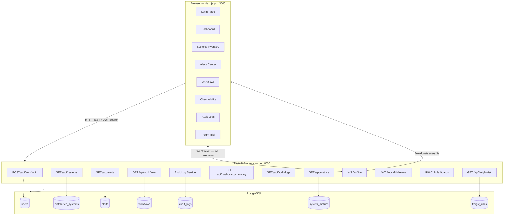

# Rail Logistics Control Plane

A single-pane-of-glass operations management platform for distributed freight rail technology systems. Built to simulate the kind of internal tooling used by large-scale railroad logistics operations — covering system health, alerting, operational workflows, observability, audit logging, and freight movement risk assessment.

> **Simulated data only.** No real railroad systems, BNSF data, or external APIs are used.

---

## Why This Project Was Built

Modern freight railroads operate thousands of distributed systems — edge gateways at rail yards, cloud-based routing services, data center batch processors, telemetry collectors, and crew scheduling adapters. Managing the health, performance, and operational state of these systems at scale requires a unified control plane.

This project demonstrates:
- Full-stack engineering with FastAPI + Next.js
- Distributed systems modeling across cloud, edge, and data center environments
- Real-time observability via WebSocket live updates
- Role-based access control enforced at the API layer
- Audit logging on every significant user action
- Production-quality structure: typed schemas, middleware, async DB, Docker Compose

---

## Architecture



---

## Tech Stack

| Layer | Technology |
|---|---|
| Frontend | Next.js 14 (App Router), TypeScript, Tailwind CSS |
| Charts | Recharts |
| UI Components | Custom components with Radix UI primitives |
| Backend | FastAPI, Python 3.11+ |
| Database | PostgreSQL 16 (SQLite for local dev/tests) |
| ORM | SQLAlchemy 2.0 async |
| Auth | JWT (python-jose), bcrypt (passlib) |
| Validation | Pydantic v2 |
| Logging | structlog (structured JSON) |
| Real-time | WebSocket (native FastAPI + browser WebSocket) |
| Testing | pytest, pytest-asyncio, httpx |
| Infrastructure | Docker Compose |

---

## Local Setup

### Option A — Docker Compose (full stack)

```bash
git clone <repo-url>
cd rail-logistics-control-plane

cp .env.example .env
# Edit .env if needed (defaults work for local dev)

docker compose up --build
```

- Frontend: http://localhost:3000
- Backend API: http://localhost:8000
- API Docs (Swagger): http://localhost:8000/docs
- API Docs (ReDoc): http://localhost:8000/redoc

---

### Option B — Local development (no Docker)

**Backend:**

```bash
cd backend
python -m venv .venv && source .venv/bin/activate
pip install -r requirements.txt

# Uses SQLite by default — no Postgres needed for dev
uvicorn app.main:app --reload
```

**Frontend:**

```bash
cd frontend
npm install
npm run dev
```

---

### Running tests

```bash
cd backend
source .venv/bin/activate
pytest -v
```

---

## Demo Credentials

| Role | Email | Password | Permissions |
|---|---|---|---|
| Admin | admin@railops.local | admin123 | Full access — read + mutate all resources, approve workflows, manage users |
| Operator | operator@railops.local | operator123 | Read all + acknowledge/resolve alerts + create workflow requests |
| Viewer | viewer@railops.local | viewer123 | Read-only access to all dashboards and tables |

---

## RBAC Explanation

Role-based access control is enforced at the API layer using FastAPI dependency injection. Every protected route declares a role guard (`require_admin()`, `require_operator_or_admin()`, or `require_any_role()`). The JWT payload carries the user's role and is verified on every request.

| Action | Admin | Operator | Viewer |
|---|:---:|:---:|:---:|
| View dashboard, systems, alerts, workflows | ✅ | ✅ | ✅ |
| View audit logs, metrics, freight risk | ✅ | ✅ | ✅ |
| Acknowledge alerts | ✅ | ✅ | ❌ |
| Resolve alerts | ✅ | ✅ | ❌ |
| Create workflow requests | ✅ | ✅ | ❌ |
| Approve / reject workflows | ✅ | ❌ | ❌ |
| Create / update / delete systems | ✅ | ❌ | ❌ |

---

## API Route Summary

### Auth
| Method | Route | Description |
|---|---|---|
| POST | /api/auth/login | Authenticate and receive JWT |
| GET | /api/auth/me | Get current user from token |

### Systems
| Method | Route | Description |
|---|---|---|
| GET | /api/systems | List all distributed systems |
| GET | /api/systems/{id} | Get system by ID |
| POST | /api/systems | Create system (admin) |
| PATCH | /api/systems/{id} | Update system (admin) |
| DELETE | /api/systems/{id} | Delete system (admin) |

### Alerts
| Method | Route | Description |
|---|---|---|
| GET | /api/alerts | List alerts (filter by severity, status) |
| GET | /api/alerts/{id} | Get alert by ID |
| POST | /api/alerts | Create alert (admin) |
| POST | /api/alerts/{id}/acknowledge | Acknowledge alert (operator+) |
| POST | /api/alerts/{id}/resolve | Resolve alert (operator+) |

### Workflows
| Method | Route | Description |
|---|---|---|
| GET | /api/workflows | List workflows |
| GET | /api/workflows/{id} | Get workflow by ID |
| POST | /api/workflows | Create workflow request (operator+) |
| POST | /api/workflows/{id}/approve | Approve workflow (admin) |
| POST | /api/workflows/{id}/reject | Reject workflow (admin) |

### Observability
| Method | Route | Description |
|---|---|---|
| GET | /api/metrics | List system metrics |
| GET | /api/dashboard/summary | Aggregate dashboard statistics |

### Other
| Method | Route | Description |
|---|---|---|
| GET | /api/audit-logs | List audit logs |
| GET | /api/freight-risk | List freight movement risk items |
| WS | /ws/live | Live system and alert updates |
| GET | /health | Backend health check |

---

## Observability Explanation

The platform takes an OpenTelemetry-inspired approach without requiring a full Prometheus/Grafana stack:

- **System metrics** are stored in `system_metrics` table with fields modeled after Prometheus metric conventions: `latency_ms`, `request_count`, `error_rate`, `heartbeat_age_seconds`, `alert_count`.
- **Structured JSON logging** is implemented via `structlog` — every request logs actor, action, duration, and status code.
- **WebSocket live feed** broadcasts `system_update`, `alert_update`, and `metric_update` events every 3 seconds with realistic jitter to simulate live telemetry.
- **Dashboard aggregates** (avg latency, health by environment, alert volume by severity) are computed server-side from live DB state.
- **Heartbeat freshness** is tracked per system (`last_heartbeat`) and surfaced in the observability table.

---

## Security Notes

- Passwords are hashed with bcrypt (cost factor 12) — never stored in plaintext.
- JWTs are signed with HS256 using a configurable `SECRET_KEY`. Tokens expire after 60 minutes by default.
- CORS is restricted to explicitly configured origins.
- All inputs are validated via Pydantic v2 schemas before reaching business logic.
- Role checks use FastAPI dependency injection — routes cannot be called without the middleware chain executing.
- Audit logs record every write action with actor identity, resource type, resource ID, and a metadata snapshot.
- The `.env.example` ships with placeholder secrets — never commit real credentials.

---

## Resume Bullet Examples

- Built a full-stack freight rail operations control plane with FastAPI, Next.js, PostgreSQL, and WebSockets; implemented JWT authentication, async SQLAlchemy, and role-based access control enforced at the API layer
- Designed a real-time observability dashboard with live system health, latency trends, and alert volume charts using WebSocket broadcasts and Recharts
- Implemented structured audit logging middleware capturing actor, action, resource, and metadata on every significant write operation across the platform
- Modeled distributed systems inventory spanning cloud, edge, and data center environments with per-system heartbeat tracking, latency monitoring, and freight movement risk scoring
- Containerized the full stack with Docker Compose including PostgreSQL health checks and multi-stage Next.js builds; added a pytest suite covering RBAC enforcement across all user roles

---

## Future Improvements

- **Alembic migrations** — replace `create_all` startup with versioned migration scripts
- **Prometheus exporter** — expose `/metrics` endpoint compatible with real Prometheus scraping
- **Grafana integration** — connect pre-built dashboards to the metrics endpoint
- **SSE as fallback** — Server-Sent Events for environments where WebSocket is blocked
- **Notification channels** — PagerDuty/Slack webhook integration for critical alerts
- **Multi-region view** — aggregate health across geographic regions with a map visualization
- **CI/CD pipeline** — GitHub Actions for lint, test, build, and Docker image push
- **Rate limiting** — per-IP and per-user rate limits on auth and mutation endpoints
- **Refresh tokens** — sliding session with secure HttpOnly cookie storage
- **User management UI** — admin interface for creating and deactivating users
